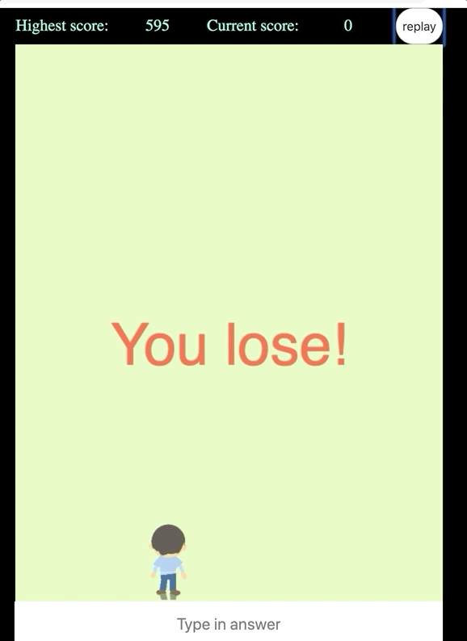

[](https://travis-ci.org/Nziranziza/rocket)  [](https://coveralls.io/github/Nziranziza/rocket?branch=168424328-add-unit-test) <a href="https://codeclimate.com/github/Nziranziza/rocket/maintainability"> </a>[](https://snyk.io/test/github/Nziranziza/rocket)
# rockIt - Mathematical calculation Game for Kids 

### How to get started

Install dependencies
```
npm install
```

Run the application
```
npm start
```

